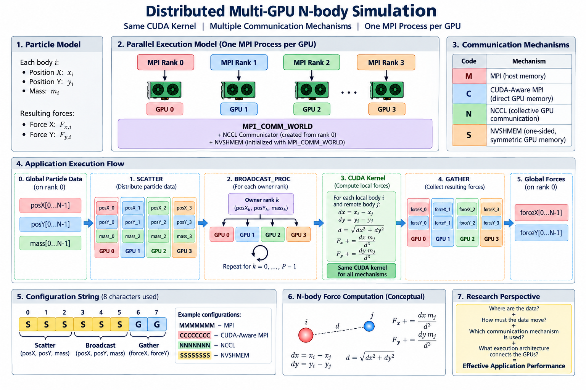

## 1. Overview



This project implements a distributed **N-body benchmark for multi-GPU systems**. It uses **one MPI process per GPU** and provides four communication alternatives:

| Code | Communication mechanism |
|---|---|
| `M` | MPI |
| `C` | CUDA-Aware MPI |
| `N` | NCCL |
| `S` | NVSHMEM |

A complete configuration contains exactly eight characters. Homogeneous examples are:

```text
MMMMMMMM = MPI
CCCCCCCC = CUDA-Aware MPI
NNNNNNNN = NCCL
SSSSSSSS = NVSHMEM
```

The eight positions select the mechanisms used for the three initial distributions, three partition exchanges, and two final force collections. Mixed configurations are accepted by the generic communication path. The all-NVSHMEM configuration (`SSSSSSSS`) uses a dedicated optimized execution path with **one-sided communication, asynchronous prefetching, double buffering, and communication/computation overlap**.

Each body is represented by its X and Y positions and mass. For a local body \(i\), the force contribution from body \(j\) is computed from

$$dx=x_i-x_j, \qquad dy=y_i-y_j, \qquad d=\sqrt{dx^2+dy^2}$$


and accumulated as

$$
F_x \mathrel{+}= \frac{dx\,m_j}{d^3}, \qquad
F_y \mathrel{+}= \frac{dy\,m_j}{d^3}.
$$

Self-interaction is skipped when the source and local partitions are the same.

The global arrays are divided equally among MPI processes:

```text
local_size = number_of_bodies / number_of_processes
```

Therefore, `number_of_bodies` must be positive and exactly divisible by the number of MPI processes.

---

## 2. Parallel Execution Model

The benchmark follows a **one MPI process per GPU** model. For four GPUs:

```text
MPI Rank 0  <-->  NVSHMEM PE 0  <-->  GPU 0
MPI Rank 1  <-->  NVSHMEM PE 1  <-->  GPU 1
MPI Rank 2  <-->  NVSHMEM PE 2  <-->  GPU 2
MPI Rank 3  <-->  NVSHMEM PE 3  <-->  GPU 3
```

MPI is initialized first. NVSHMEM is initialized with `MPI_COMM_WORLD` using:

```cpp
nvshmemx_init_attr(NVSHMEMX_INIT_WITH_MPI_COMM, &attr);
```

The program verifies that MPI ranks and NVSHMEM PEs have identical mappings. NCCL is also initialized for the processes so the same executable can exercise MPI, CUDA-Aware MPI, NCCL, and NVSHMEM communication paths.

---

## 3. Communication Configuration

The eight communication positions are interpreted as:

```text
communication_libraries[0] -> Scatter posX
communication_libraries[1] -> Scatter posY
communication_libraries[2] -> Scatter mass

communication_libraries[3] -> Exchange posX partitions
communication_libraries[4] -> Exchange posY partitions
communication_libraries[5] -> Exchange mass partitions

communication_libraries[6] -> Gather forceX
communication_libraries[7] -> Gather forceY
```

For MPI, CUDA-Aware MPI, NCCL, or mixed configurations, `n_body()` uses the generic communication abstraction implemented in `HPC_api.c` through `SCATTER()`, `BROADCAST_PROC()`, and `GATHER()`.

When all eight positions are `S`, `n_body()` dispatches to the specialized `n_body_nvshmem()` implementation instead of the generic path.

---

## 4. Generic Execution Flow

The MPI, CUDA-Aware MPI, NCCL, and mixed execution path follows:

```text
Global posX / posY / mass
          |
          v
       SCATTER
          |
          v
Local posXl / posYl / massl
          |
          v
forceXl = forceYl = 0
          |
          v
+---------------------------+
| for each partition owner  |
+---------------------------+
          |
          +--> local partition
          |
          +--> remote partition -> BROADCAST_PROC
          |
          v
  tiled CUDA N-body kernel
          |
          v
 accumulate forceXl/forceYl
          |
          v
        GATHER
          |
          v
    forceX / forceY
```

This path keeps the computational kernel fixed while changing the communication mechanism.

---

## 5. Optimized NVSHMEM Execution Path

The homogeneous `SSSSSSSS` configuration uses a dedicated NVSHMEM path designed to reduce synchronization and overlap remote communication with GPU computation.

### 5.1 One-sided GPU communication

Remote particle partitions are obtained with stream-ordered nonblocking NVSHMEM GET operations:

```cpp
nvshmemx_double_get_nbi_on_stream(...);
nvshmemx_quiet_on_stream(...);
```

The consumer PE explicitly fetches the required remote partition from the owner's symmetric GPU memory. This differs from the collective communication model used by the other paths.

### 5.2 Double buffering

Two symmetric staging buffers are maintained for each remote particle field:

```text
remotePosX[0] / remotePosX[1]
remotePosY[0] / remotePosY[1]
remoteMass[0] / remoteMass[1]
```

They are used in ping-pong order. While the compute stream consumes one buffer, the communication stream can prefetch the next remote partition into the other buffer.

### 5.3 Communication/computation overlap

The pipeline is conceptually:

```text
Time ------------------------------------------------------------>

comm_stream:     GET P1          GET P2          GET P3
                    |               |               |
                    v               v               v
buffers:          buffer 0        buffer 1        buffer 0

compute_stream: LOCAL P0       COMPUTE P1      COMPUTE P2      COMPUTE P3
                         <--- communication/computation overlap --->
```

Two CUDA streams are used:

```text
comm.comm_stream     -> NVSHMEM communication
comm.compute_stream  -> CUDA N-body computation
```

CUDA events enforce the producer/consumer dependencies:

```text
GET partition
     |
     v
ready[buffer]
     |
     v
compute partition
     |
     v
consumed[buffer]
     |
     v
buffer can be reused
```

The `ready[]` events prevent computation from reading an incomplete transfer, while `consumed[]` prevents the communication stream from overwriting a staging buffer that is still being consumed.

### 5.4 Final force publication

After computation, each PE publishes its local force partition into PE 0's symmetric result arrays with:

```cpp
nvshmemx_double_put_nbi_on_stream(...);
```

PE 0 then updates the host copies of `forceX` and `forceY`, which are used for reporting and numerical validation.

---

## 6. GPU Computation and Shared-Memory Tiling

The CUDA kernel is implemented in `n_body_kernel.cu` by `partial_n_body_kernel()` and launched through `calculate_force()`.

The current block width is:

```cpp
#define TILE_DIM 256
```

The kernel **implements shared-memory tiling**. For each source tile it allocates shared arrays for positions and masses:

```cpp
extern __shared__ double shared[];

double *sPosX = shared;
double *sPosY = &shared[blockDim.x];
double *sMass = &shared[2 * blockDim.x];
```

A tile is loaded from GPU memory into shared memory and reused by the threads in the CUDA block:

```text
Global/symmetric GPU memory
            |
            | load source tile
            v
+-----------------------------+
|       CUDA shared memory    |
|    posX | posY | mass       |
+-----------------------------+
            |
            | reused by block threads
            v
   local-body force updates
```

This reduces repeated accesses to the source particle arrays during the $(O(N^2)$ interaction computation.

---

## 7. Memory Model

`MemoryType` provides three memory representations:

```cpp
void *addr_h;   // Host memory
void *addr_d;   // Conventional CUDA device memory
void *addr_s;   // NVSHMEM symmetric GPU memory
```

The generic communication path can use host and conventional CUDA buffers, while the optimized all-NVSHMEM path performs the N-body computation directly with symmetric GPU allocations where appropriate.

This design allows the project to maintain a common communication abstraction while also supporting an optimized NVSHMEM-specific execution strategy.

---

## 8. Numerical Validation

The benchmark includes an independent **sampled numerical validation** implemented in `HPC_api.c` through:

```cpp
reference_force()
validate_nbody_sampled()
```

Validation is executed by rank 0 **after the timed benchmark iterations**, so the CPU reference calculation does not affect the reported execution time.

The current configuration uses:

```cpp
const int validation_samples = 16;
const double rel_tolerance = 1.0e-10;
const double abs_tolerance = 1.0e-12;
```

The sampled body indices are deterministically distributed from `0` to `number_of_bodies - 1`. For each selected body, `reference_force()` independently recomputes the complete N-body force on the CPU and accumulates the reference result using `long double` arithmetic.

The GPU and CPU results are compared using the vector force error:

$$
E_{abs}=\sqrt{(F_x^{GPU}-F_x^{ref})^2+(F_y^{GPU}-F_y^{ref})^2}
$$

with the acceptance condition

$$
E_{abs} \leq \epsilon_{abs}+\epsilon_{rel}\lVert F^{ref}\rVert.
$$

The validator reports:

```text
Numerical validation (16 sampled bodies)
  Relative tolerance : ...
  Absolute tolerance : ...
  Max absolute error : ...
  Max relative error : ...
  Relative L2 error  : ...
  Worst sample index : ...
  Result             : PASS / FAIL
```

The relative L2 error over the sampled force vectors is also reported:

$$
E_{L2}=\frac{\lVert F^{GPU}-F^{ref}\rVert_2}{\lVert F^{ref}\rVert_2}.
$$

This validation checks numerical consistency without introducing the full $O(N^2)$ CPU validation cost for every body.

---

## 9. Source Files

The current project contains:

```text
.
├── HPC_api.c
├── HPC_api.h
├── n_body.c
├── n_body_kernel.cu
├── makefile
└── README.md
```

### `HPC_api.h`

Defines communication codes, data types, memory descriptors, process/communicator structures, communication API prototypes, and the numerical-validation interfaces.

### `HPC_api.c`

Implements MPI/NVSHMEM initialization, NCCL communicator setup, memory management, generic communication operations, and numerical validation:

```text
SCATTER()
BROADCAST()
BROADCAST_PROC()
GATHER()
reference_force()
validate_nbody_sampled()
```

### `n_body.c`

Implements command-line processing, GPU/process initialization, benchmark orchestration, the generic N-body path, and the optimized `n_body_nvshmem()` path with asynchronous prefetching and double buffering.

### `n_body_kernel.cu`

Implements the shared-memory tiled CUDA N-body force kernel.

### `makefile`

Builds the MPI/CUDA/NCCL/NVSHMEM executable using `mpic++` and `nvcc`.

---

## 10. Compilation

The Makefile obtains CUDA, NCCL, and NVSHMEM paths from:

```text
CUDA_HOME
NCCL_HOME
NVSHMEM_HOME
```

The current CUDA target is NVIDIA Volta (`sm_70`), appropriate for Tesla V100 GPUs:

```text
-gencode=arch=compute_70,code=sm_70
```

On the Sequana environment, load the required modules, including NVSHMEM, before compiling. For example:

```bash
module load nvshmem/3.1.7_cuda-11.2_sequana
make
```

The executable generated is:

```text
n_body
```

To remove generated objects and the executable:

```bash
make clean
```

---

## 11. Command-Line Arguments

The executable receives:

```text
./n_body <device_id> <number_of_bodies> <libraries>
```

where:

| Argument | Description |
|---|---|
| `device_id` | CUDA GPU assigned to the MPI process |
| `number_of_bodies` | Global number of bodies, e.g. `32768` |
| `libraries` | Eight-character communication configuration |

Example:

```bash
./n_body 0 32768 SSSSSSSS
```

means GPU 0, 32,768 global bodies, and the optimized all-NVSHMEM path.

---

## 12. Execution on One Node with Four GPUs

MPI:

```bash
mpirun -np 1 ./n_body 0 32768 MMMMMMMM \
     : -np 1 ./n_body 1 32768 MMMMMMMM \
     : -np 1 ./n_body 2 32768 MMMMMMMM \
     : -np 1 ./n_body 3 32768 MMMMMMMM
```

CUDA-Aware MPI:

```bash
mpirun -np 1 ./n_body 0 32768 CCCCCCCC \
     : -np 1 ./n_body 1 32768 CCCCCCCC \
     : -np 1 ./n_body 2 32768 CCCCCCCC \
     : -np 1 ./n_body 3 32768 CCCCCCCC
```

NCCL:

```bash
mpirun -np 1 ./n_body 0 32768 NNNNNNNN \
     : -np 1 ./n_body 1 32768 NNNNNNNN \
     : -np 1 ./n_body 2 32768 NNNNNNNN \
     : -np 1 ./n_body 3 32768 NNNNNNNN
```

NVSHMEM:

```bash
mpirun -np 1 ./n_body 0 32768 SSSSSSSS \
     : -np 1 ./n_body 1 32768 SSSSSSSS \
     : -np 1 ./n_body 2 32768 SSSSSSSS \
     : -np 1 ./n_body 3 32768 SSSSSSSS
```

Thus, four MPI processes are launched and each process is explicitly associated with one NVIDIA GPU.

---

## 13. Performance Measurement

The application executes ten benchmark iterations. Each iteration is timed with `MPI_Wtime()` around the complete `n_body()` execution and synchronized across processes.

The local elapsed times are reduced with:

```cpp
MPI_Reduce(..., MPI_MAX, ...)
```

so rank 0 uses the slowest process time for each iteration. The final reported execution time is the average of the ten reduced times:

```text
N-Body | Libraries=SSSSSSSS | Bodies=32768 | Average Time (s): ...
```

Numerical validation is performed only after these timed iterations and therefore is not included in the benchmark result.

---

## 14. Research Perspective

The benchmark separates two fundamental aspects of distributed multi-GPU execution:

```text
GPU computation
      +
communication / data movement
      =
effective application performance
```

It provides a common N-body workload for investigating:

- MPI host-mediated communication;
- CUDA-Aware MPI;
- NCCL collectives;
- NVSHMEM symmetric memory;
- one-sided GPU communication;
- asynchronous remote data movement;
- shared-memory CUDA tiling;
- double buffering;
- communication/computation overlap;
- local versus remote GPU data;
- data locality;
- multi-GPU scaling.

The optimized NVSHMEM path is particularly relevant to data-locality research because the consumer explicitly fetches remote data and can overlap this movement with useful computation:

```text
Where is the data?
       |
       +--> local  --> compute directly
       |
       +--> remote --> asynchronous GET --> compute
```

The current owner traversal remains deterministic; therefore, the project provides a foundation for future **data-locality-aware task scheduling**, where the order of computation can be selected according to data location and communication cost.

---

## 15. Experimental Interpretation

The homogeneous NVSHMEM implementation is more than a direct replacement of one communication API by another. It additionally uses an optimized pipeline with asynchronous GET operations, CUDA streams, events, and double buffering.

Consequently, comparisons such as:

```text
MPI vs CUDA-Aware MPI vs NCCL vs optimized NVSHMEM
```

measure the performance of the **implemented communication strategies as a whole**. They should not be interpreted as an isolated measurement of raw transport performance between the four libraries.

For a controlled study of the overlap contribution, a useful extension is to compare:

```text
NVSHMEM baseline (communication followed by computation)
                         vs
NVSHMEM optimized (double buffering + communication/computation overlap)
```

This separates the effect of the communication API from the effect of the pipelined execution strategy.

---

## 16. Research Motivation

As GPU computational capability increases, performance increasingly depends on the relationship among computation, communication, and data placement:

```text
Where are the data?
        +
How must the data move?
        +
Which communication mechanism is used?
        +
Can communication overlap computation?
        =
Effective Application Performance
```

The project therefore serves as an experimental platform for research involving:

**Distributed Multi-GPU Computing · Data Locality · GPU Communication · MPI · CUDA-Aware MPI · NCCL · NVSHMEM · Communication/Computation Overlap · N-Body Simulation · High-Performance Computing**.
